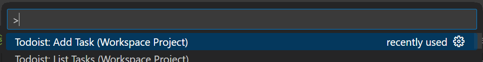
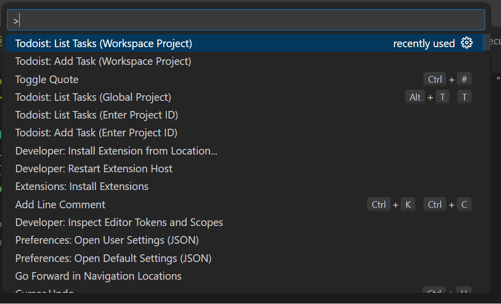

# Todoist for Code

Track and sync your development todos with [Todoist](https://todoist.com), right in VSCode! Based on the [VSCode Todoist extension by waymondo](https://github.com/waymondo/vscode-todoist), with the addition of support for labels and priorities, and some other changes.

## Features & Usage

Each command has a global user, workspace, and parameterized version. Both the global user and workspace commands will use the Todoist project set in your `todoist.projectId` setting; if this is not set, then you will be prompted to choose or create a Todoist project. Parameterized commands, on the other hand, take the Todoist project as a parameter. Note that parameterized commands do not have a default keybinding, and instead require you to configure your own keybindings for them (see below).

This VSCode extension adds several commands to the command palette:

### Todoist: Add Task

Default Keybinding (Workspace Project) <kbd>alt+t c</kbd><br>
Default Keybinding (Global Project) <kbd>alt+t C</kbd>



Pop open an input box to capture a task for the project. Add labels using `@mylabel` (surround the label with double or single quotes to include a space in it: `@"my label"`) and set a priority with `!!1` to `!!4`, just like in the Todoist app. If you have a text selection made when this is invoked, it will add a link to your current file and line number to the task description, for easy deep linking from the Todoist desktop app.

### Todoist: List Tasks

Default Keybinding (Workspace Project) <kbd>alt+t t</kbd><br>
Default Keybinding (Global Project) <kbd>alt+t T</kbd>



Shows all the incomplete tasks in the Todoist project. Type in the input box to filter the list (it searches the task name, labels and priority). Selecting an item will open a dialog from which you can mark the task as complete/incomplete or edit it in the Todoist app. Press <kbd>Esc</kbd> to dismiss the list.

### Todoist: Open

Default Keybinding (Workspace Project) <kbd>alt+t o</kbd><br>
Default Keybinding (Global Project) <kbd>alt+t O</kbd>

If you have the Todoist desktop app installed, this will open or switch to the Todoist app and select your current project.

## Configuring Custom Project Shortcuts

You can configure multiple shortcuts to help you open, list, and capture tasks for your Todoist projects. To do this, you will need to add a keybinding for each shortcut you want to use. For example, to add a shortcut for a project with the id `123456789`, you would add the following to your `keybindings.json` file:

```json
{
  "key": "ctrl+shift+1",
  "command": "extension.todoistCaptureId",
  "args": "123456789" // Put your project ID here
}
```

The commands you can use are:

* `extension.todoistCaptureId` to add a new task to the project
* `extension.todoistTodosId` to list incomplete tasks in the project
* `extension.todoistOpenId` to open the project in the Todoist app

For more information on how to configure keybindings, see the [VSCode documentation](https://code.visualstudio.com/docs/getstarted/keybindings).

## Requirements & Installation

Obviously this requires a [Todoist](https://todoist.com) account. To use "Todoist Open" and take advantage of the deep linking feature, you will also need the Todoist desktop app.

To install this extension, you can get it from VSCode store or open the command palette and enter:

```sh
ext install kevinwilson.todoistforcode
```

Finally, run any extension command from the command palette and you will be prompted to enter your Todoist API token,
which can be found [here](https://todoist.com/prefs/integrations) (under the 'Developer' tab).

You may set `todoist.projectId` in your user and workspaces settings manually or with the commands above.

## Project Goals & Motivation

* Create a simple and lightweight method of capturing and organizing tasks on a per-project basis.

* Leverage a well-featured todo app service instead of re-invent the wheel.

* Todoist is a good candidate for such a service, since you can easily stay in touch with your tasks on the go with their mobile apps.

* Implement a way where the basic features can be used strictly from within VSCode.
